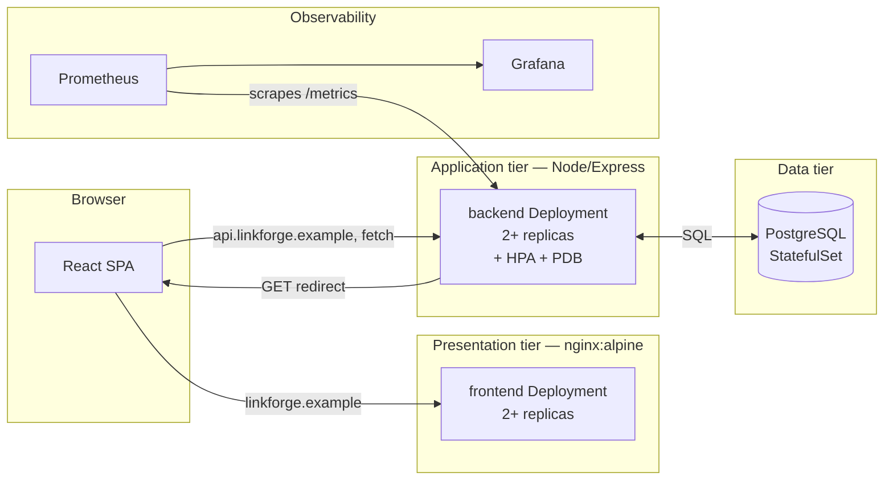

# LinkForge

A URL shortener built as a working example of a three-tier application:
presentation (React), application (Node/Express API), and data
(PostgreSQL) — containerized, tested, deployed via GitOps, and observed
with Prometheus/Grafana.

This exists as a reference, not a product. It's deliberately small
enough to read end to end in one sitting, while being honest about
where a real production system would need more than what's here (see
[Known limitations](#known-limitations)).

## Architecture



Two Ingress hosts rather than one, split by path: the backend's
redirect route lives at the *root* (`GET /:code`), which would collide
with the frontend's own routes on a shared host. `linkforge.example`
serves the SPA; `api.linkforge.example` serves both the JSON API and
the short-link redirects themselves.

## Repository layout

```
backend/        Express API — links CRUD, redirect+click tracking, /metrics
frontend/       React SPA — Vite build, runtime-configured API origin
db/migrations/  SQL schema
deploy/
  docker-compose.yml       full local stack
  k8s/base/                namespace, Postgres, backend, frontend, Ingress,
                            ServiceMonitor, PrometheusRule
  k8s/overlays/{dev,prod}/ Kustomize overlays — replicas, hostnames, images
  argocd/                  ArgoCD Application per environment
  monitoring/               Grafana dashboard JSON
.github/workflows/
  ci.yml          tests + Dockerfile builds + kustomize validation on every PR
  cd.yml          builds/pushes images, updates the GitOps manifests
```

## Running it locally

```sh
cd deploy
docker compose up --build
```

- Frontend: http://localhost:8081
- API: http://localhost:8080
- Postgres: localhost:5432 (`linkforge` / `linkforge`)

## Running the tests

Backend unit tests need nothing but Node:

```sh
cd backend && npm install && npm run test:unit
```

Backend integration tests need a real Postgres reachable via the
standard `PG*` env vars (`PGHOST`, `PGUSER`, `PGPASSWORD`,
`PGDATABASE`) — CI provisions this as a `postgres:16-alpine` service
container; locally, `docker compose up db` or a local install both
work:

```sh
cd backend && npm run test:integration
```

Frontend:

```sh
cd frontend && npm install && npm test && npm run build
```

All of the above — 10 unit tests, 3 integration tests against a real
database, 3 frontend component tests, and a production build — passed
in the environment this repo was built in before anything was pushed.

## Deploying

The Kubernetes manifests are real and `kustomize build` clean for
`base`, `overlays/dev`, and `overlays/prod` — but nothing in this repo
has been applied to a live cluster. There's no cluster on the other
end of the ArgoCD `Application` manifests in `deploy/argocd/` until
you point one there. To actually take this live:

1. Pick a cluster (kind, a homelab node, or a managed one) and install
   an ingress controller + cert-manager if you want the Ingress/TLS
   pieces to work as written, and kube-prometheus-stack if you want
   the `ServiceMonitor`/`PrometheusRule` to be picked up.
2. Install ArgoCD, then `kubectl apply -f deploy/argocd/application-dev.yaml`.
   Dev is auto-sync — from that point, every push to `main` that
   passes CI updates `deploy/k8s/overlays/dev`'s image tags, and
   ArgoCD picks it up on its own.
3. For prod: `kubectl apply -f deploy/argocd/application-prod.yaml`.
   Prod does **not** auto-sync. Tagging a release (`git tag v1.0.0`)
   builds and pushes images and updates `overlays/prod`, but syncing
   that into the cluster is a deliberate, separate action (`argocd app
   sync linkforge-prod` or the UI) — see the commented-out job at the
   bottom of `cd.yml` for wiring that up once there's a real
   `ARGOCD_SERVER` to point at.
4. Replace the placeholder `Secret` in `deploy/k8s/base/postgres.yaml`
   before any of this touches real data — see
   [Known limitations](#known-limitations).

## Monitoring

The backend exposes Prometheus metrics at `/metrics`: request
rate/latency/errors by route, Node.js runtime metrics (event loop lag,
heap, GC) via `prom-client`'s default collector, and two
domain-specific counters (`linkforge_links_created_total`,
`linkforge_links_redirected_total`). `deploy/k8s/base/servicemonitor.yaml`
wires that into a kube-prometheus-stack Prometheus; `prometheusrule.yaml`
alerts on 5xx rate, p99 latency, target-down, and crash-looping pods.
`deploy/monitoring/grafana-dashboard.json` is a real dashboard
definition built against those exact metric names — import it into
Grafana pointed at that Prometheus and the panels resolve immediately.

## Known limitations

Stated plainly rather than glossed over:

- **Postgres is a bare StatefulSet**, not a managed database or an
  operator (CloudNativePG, Zalando). One replica, no automated
  failover or backups. Fine for this demo; not what I'd run for
  anything with real data.
- **The committed `Secret` is a placeholder.** GitOps means everything
  is in git, which means plaintext Secrets in git are a non-starter —
  this repo ships one anyway, clearly marked, because wiring up
  External Secrets Operator or Sealed Secrets needs a real secret
  backend to point at. Replace it before this touches anything real.
- **The Dockerfiles and docker-compose stack are written to known-good
  patterns but not build-tested end-to-end** in this repo's own CI
  history yet — `ci.yml`'s `docker-build` job builds both images on
  every PR going forward, which is the actual proof; nothing here
  claims that job has run yet.
- **`package-lock.json` isn't committed.** It's ~280KB of generated
  JSON per tier with no hand-reviewable content, so it's `.gitignore`d
  and CI/Docker builds use `npm install` rather than `npm ci`. That
  trades exact reproducible installs for a cleaner diff history. For
  anything beyond a reference repo, commit the lock files and switch
  back to `npm ci` in both `ci.yml` and the Dockerfiles.
- **No live cluster.** Every Kubernetes manifest is `kustomize build`
  clean and `actionlint` clean for the workflows, but "renders
  correctly" and "runs correctly on your cluster" are different
  claims. Treat this as a well-formed starting point, not a fait
  accompli.
