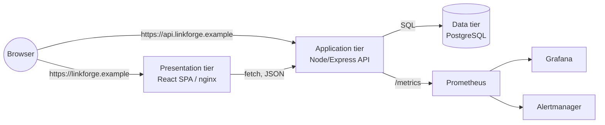

# LinkForge — High-Level Design

Companion to [PRD.md](./PRD.md) (what/why) — this document covers how the
system is built. Decision rationale for anything marked with an ADR
reference lives in [ADR.md](./ADR.md); this document describes the
resulting shape, not the reasoning.

## 1. System context



Two public hostnames rather than one — `linkforge.example` for the SPA,
`api.linkforge.example` for both the JSON API and the short links
themselves (`api.linkforge.example/<code>`). See ADR-002 for why.

## 2. Component breakdown

### 2.1 Presentation tier (`frontend/`)

- React 18 SPA, built with Vite, served as static files by nginx.
- Single view: a form to submit a URL, and a table of existing links with
  their click counts. No client-side routing — one page is all the product
  needs.
- Talks to the application tier over `fetch`, resolving its base URL from
  `window.__LINKFORGE_CONFIG__`, written by the container at startup (ADR-003).
- Stateless: horizontally scalable with no session affinity requirement.

### 2.2 Application tier (`backend/`)

- Node.js 22 + Express 4, CommonJS.
- One router (`src/routes/links.js`) covering all product endpoints; app
  assembly, health checks, and metrics live in `src/app.js`.
- Stateless itself — all state lives in Postgres, reached through a
  connection pool (`src/db.js`) constructed once per process.
- Exposes three operational endpoints that exist for the platform, not the
  product: `/healthz` (liveness, no DB check), `/readyz` (readiness, DB
  check), `/metrics` (Prometheus exposition format).

### 2.3 Data tier (`db/migrations/`, `deploy/k8s/base/postgres.yaml`)

- PostgreSQL 16, one table (`links`), one supporting index
  (`idx_links_created_at`, DESC, for the "recent links" listing — the
  UNIQUE constraint on `code` already provides the index the redirect path
  needs).
- Deployed as a single-replica `StatefulSet` for this reference build — see
  ADR-005 for why that's an explicit, bounded trade-off and not a
  production recommendation.

### 2.4 Observability (cross-cutting)

- The application tier's `/metrics` endpoint exposes: default Node.js
  runtime metrics (`prom-client`'s collector — event loop lag, heap, GC),
  HTTP metrics by route/method/status (rate, duration histogram), and two
  product-specific counters (`linkforge_links_created_total`,
  `linkforge_links_redirected_total`).
- `ServiceMonitor` (`deploy/k8s/base/servicemonitor.yaml`) wires that into
  a kube-prometheus-stack Prometheus. `PrometheusRule`
  (`prometheusrule.yaml`) alerts on the four conditions in PRD §7 plus
  crash-looping pods.
- `deploy/monitoring/grafana-dashboard.json` is a real dashboard built
  against those exact metric names.

### 2.5 Deployment (cross-cutting)

- Kustomize: one `base/` (namespace, both Deployments, the StatefulSet,
  Ingress, monitoring resources) and two overlays (`dev/`, `prod/`) that
  patch replica counts, image tags, hostnames, and (prod only) pod
  anti-affinity. See ADR-004 for why Kustomize over Helm.
- ArgoCD: one `Application` per environment (`deploy/argocd/`), not an
  `ApplicationSet` — two environments doesn't earn that abstraction yet.
  Dev auto-syncs from `main`; prod requires a deliberate sync action. See
  ADR-006.
- CI/CD: GitHub Actions. `ci.yml` tests and validates every PR; `cd.yml`
  builds/pushes images and updates the GitOps manifests on `main`/tags —
  see [RUNBOOK.md](./RUNBOOK.md) for the operational detail.

## 3. Data model

```
links
├── id            BIGSERIAL PRIMARY KEY
├── code          VARCHAR(16)  UNIQUE NOT NULL   -- 7-char nanoid, base62
├── original_url  TEXT         NOT NULL
├── clicks        BIGINT       NOT NULL DEFAULT 0
└── created_at    TIMESTAMPTZ  NOT NULL DEFAULT now()
```

One table is sufficient for the current functional scope (PRD §5). No
foreign keys, because there is no second entity yet (no users, no tags).

## 4. API surface

Full request/response contract lives in [API.md](./API.md). Summary:

| Method | Path | Purpose |
|---|---|---|
| POST | `/api/links` | Create a short link |
| GET | `/api/links` | List recent links |
| GET | `/api/links/:code/stats` | Single link detail |
| GET | `/:code` | Redirect + increment click count |
| GET | `/healthz` | Liveness |
| GET | `/readyz` | Readiness |
| GET | `/metrics` | Prometheus scrape target |

## 5. Deployment topology

```
Ingress (nginx-ingress)
├── linkforge.example        → Service: frontend  → Deployment: frontend (2+ pods)
└── api.linkforge.example    → Service: backend    → Deployment: backend  (2-8 pods, HPA)
                                                          │
                                                          ▼
                                              Service: postgres (headless)
                                                          │
                                                          ▼
                                          StatefulSet: postgres (1 pod, 5Gi PVC)
```

Environment differences (full detail in the overlay `kustomization.yaml`
files):

| | dev | prod |
|---|---|---|
| backend replicas | 1 | 3 |
| frontend replicas | 1 | 2 |
| image tag | `edge` (floating, updated every `main` push) | `stable` (pinned per release tag) |
| pod anti-affinity | none | preferred, spread across nodes |
| ArgoCD sync | automated + selfHeal | manual only |
| hostnames | `dev.linkforge.example`, `api.dev.linkforge.example` | `linkforge.example`, `api.linkforge.example` |

## 6. Security posture

- All containers run as non-root with a fixed UID, `seccompProfile:
  RuntimeDefault`, and all Linux capabilities dropped.
- The backend container's root filesystem is read-only (the frontend's
  isn't — nginx needs to write its own cache/pid directories; see the
  comment in `deploy/k8s/base/frontend.yaml`).
- **No authentication exists anywhere in this system** (PRD §3). This is
  the single biggest gap between "reference architecture" and "production
  system" — treat every endpoint as public.
- The committed `Secret` in `postgres.yaml` is a placeholder with a
  `CHANGE_ME` value, flagged in three separate places (the manifest
  comment, the README, this document) so it can't be missed. A real
  deployment needs External Secrets Operator or Sealed Secrets in front of
  it before it touches real data.

## 7. What this design explicitly does not solve

Carried over from the PRD's non-goals, restated as design gaps rather than
product gaps:

- No caching layer — every redirect hits Postgres. At the traffic this is
  designed for, that's fine; it would not be fine at scale, and adding a
  cache would be a real design change (cache invalidation on click-count
  updates), not a config tweak.
- No connection pooling story beyond `pg`'s built-in `Pool` (max 10
  connections per backend pod). At 8 backend replicas (HPA max), that's up
  to 80 connections against a single Postgres pod with no PgBouncer in
  front of it — a real ceiling worth knowing about before scaling tests.
- No multi-region or DR design (Constraints, PRD §8).
